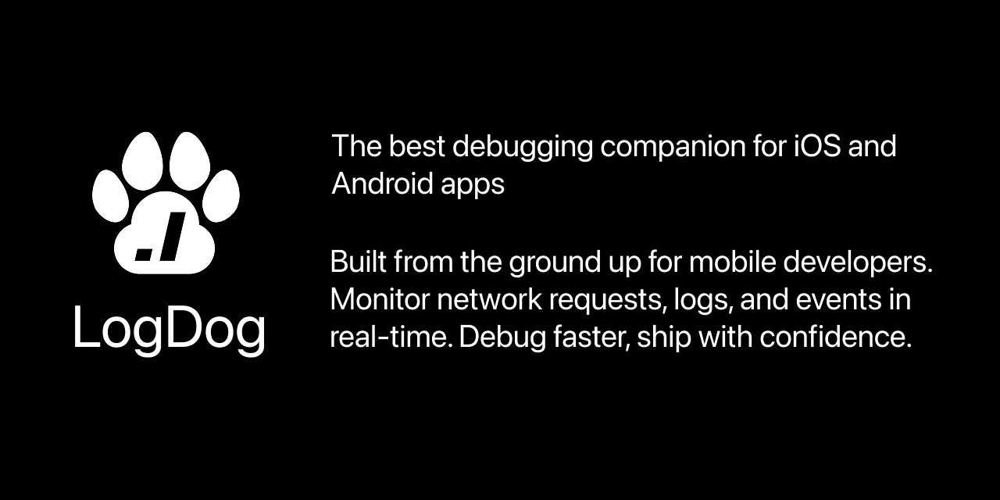

# LogDog for iOS (Version: 1.4.471)

LogDog is a powerful logging and monitoring SDK for iOS applications that helps you track network requests, events, logs, and analytics in real-time.

## Documentation

For complete documentation, visit the [LogDog Documentation Portal](https://docs.logdog.app).

## Features

- **Network Monitoring**: Automatically capture URLSession requests and responses
- **Event Tracking**: Log custom events with detailed metadata
- **Log Collection**: Capture application logs across different log levels
- **Real-time Dashboard**: View all captured data in the LogDog dashboard
- **Minimal Performance Impact**: Designed for efficiency with minimal overhead

## Installation


### Cocoa Pods 

```
target 'log-dog-ios-boilerplate' do
  # Comment the next line if you don't want to use dynamic frameworks
  use_frameworks!
  pod 'LogDogSDK', '1.4.471'
end
```

```bash
pod install
```

Note: If problems with cocoa pods occur try:

```
pod 'LogDogSDK', :podspec => 'https://raw.githubusercontent.com/modrena/log-dog-ios-sdk/v{VERSION}/LogDogSDK.podspec'
```

### Troubleshooting with Cocoa Pods

If you receive build errors like "Sandbox: rsync..." try the following:

```
Build Settings -> ENABLE_USER_SCRIPT_SANDBOXING -> No
```

## Quick Start

1. Initialize LogDog in your AppDelegate:

```swift
import LogDog

@UIApplicationMain
class AppDelegate: UIResponder, UIApplicationDelegate {
    func application(_ application: UIApplication, didFinishLaunchingWithOptions launchOptions: [UIApplication.LaunchOptionsKey: Any]?) -> Bool {
         LogDog.initialize()
         let config = LogDogConfig(apiKey: "YOUR_API_KEY", logs: true, network: true, events: true)
         LogDog.start(config: config)
         LogDog.i("Hello from LogDog!")
        return true
    }
}
```
